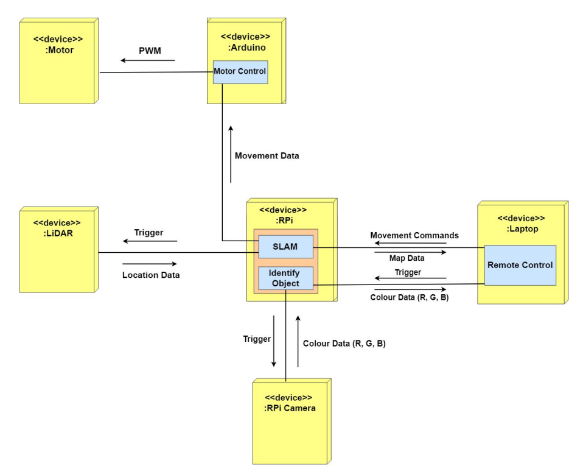
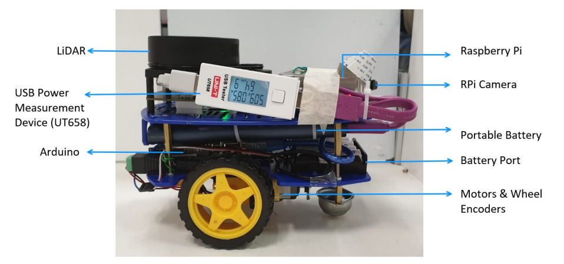

# Alex-Search-Rescue-Robot

## Introduction

Our project aims to build a tele-operated robot, Alex, which can be used to perform search and rescue operations effectively. In order to achieve this purpose, Alex comes with a variety of specifications and requirements. 

## System Architecture

Communications between the Laptop, Raspberry Pi (RPi) and subsequently all the other
components are shown in the above diagram. Communications between the Laptop and RPi will be
conducted through a secure Transport Layer Security (TLS) connection to prevent other
unauthorized users from controlling Alex. The RPi (server) will receive commands from the
Laptop (client) and subsequently relay the commands to all other connected peripherals
(Arduino, RPi Camera, LiDAR, Motors).

## Hardware Design

## High-level Algorithm

1. Initialize
2. Scan room and send map data to laptop
3. Carry out Simultaneous Localization and Mapping (SLAM)
4. Execute command given from laptop
5. Repeat Steps 2 to 4 until all the rooms have been mapped

### Further Breakdown:
1. Initialization
    - Run the server code on the RPi and the client code on the laptop
    - Initialize ROS and start visualizing Hector SLAM on the visualization software RViz
2. Scan room and send map data to laptop
    - Send data from LiDAR to the laptop via the secure communication channel
    - Set the ATmega328P chip in the Arduino to Idle sleep mode using the Sleep Mode Control Register (SMCR) to save power
3. Carry out SLAM on the laptop
    - Extract possible landmarks from LiDAR Data
    - Associate observed data points with possible landmarks
    - Estimate location
    - Re-observe landmarks with estimated location and observation data in order to update current location and map
    - Update map
4. Execute command given from laptop
    - Make the Arduino exit Idle sleep mode by manipulating SMCR
    - Use polling to obtain user input from the laptop
    - If there are objects present in the room,
      - Move Alex towards possible object to obtain RGB colour values via RPi Camera
      - Determine colour using check_red and check_green functions
      - Send colour of object from RPi to laptop via the secured communication network
      - Repeat Steps 4.b.i and 4.b.iii for every possible object in the room, keeping track of overall angle of rotation
      - Rotate Alex to original orientation by rotating in the opposite direction of the overall angle of rotation
      - Navigate Alex towards the exit (one of the exits if there are multiple exit options)
5. Repeat Steps 2 to 4 until all rooms have been mapped

##### For more details, please look at the `Final Report.pdf` document. 
